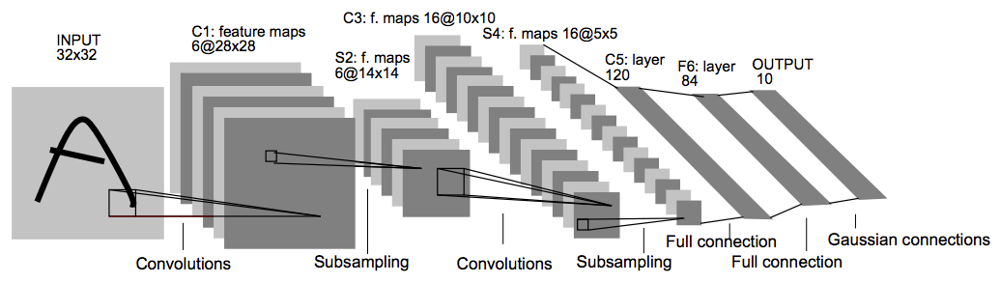
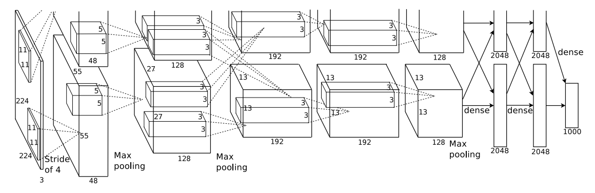

### （持续更新中）

从CNN鼻祖LeNet5到掀起深度学习浪潮的AlexNet，CNN发展到今天，出现了众多网络结构，诸如VGG、GoogleNet、ResNet、DenseNet、ResNext。这些网络结构都是怎样的，他们之间有哪些联系与区别，本文将梳理CNN的发展脉络，解读其进化之路。

CNN的结构设计很重要，它的发展进化也是目前计算机视觉等利用深度学习技术领域发展的基石。Universal approximation theorem告诉我们，一个由大量神经元组成的单隐藏层普通全连接神经网络，便能拟合任意函数，少量神经元多个隐藏层的全连接层也能有类似的能力。开个脑洞，比如，输入你自己的名字到网络中去，然后想让网络输出《清明上河图》这幅图像，可以；把你名字倒过来输入到网络中，让图中茶馆某个喝茶的客人变成你，也可以。这种能力看起来很神奇，貌似随便设计个全连接网络，它有能力将任意输入映射到任意你想要的输出上去，还需要我们费尽做实验研究新网络结构干嘛呢？但可惜的是，这仅仅是理论上的，实际上但受制于训练数据与优化能力，对于一个单隐藏层经典全连接神经网络来说，几乎是不可能的。不仅这个脑洞不行，连一些最简单图像识别任务，全连接网络都不能很好的完成任务。

CNN卷积层可以看做一种特殊的全连接层，它在全连接基础引入局部连接与权值共享的约束，这些约束包括非线性激活函数（如：relu）、池化层，这似乎将神经网络任意拟合能力约束到一个更窄的范围内，但正是由于引入了这样的约束使得网络参数下降，输出可能性下降，更容易优化。这可以看做引入了一定的先验知识（prior），不过这种先验知识没那么好引入。目前整体上深度学习领域的研究还处于trial and error的阶段，相关的指导理论并没有成熟，就像其他很多实验科学一样，在试验阶段不断总结经验教训，在经验基础上经过理想化形成指导理论，我们接下要看的这些在进化路上CNN架构就是升华经验、形成指导理论的基石。

## LeNet5
网络结构图：



LeNet5是第一个比较完善的CNN模型，可以算作深度卷积神经网络鼻祖，由深度学习先驱、著名学者Yann LeCun提出，发表于90年代末，并成功应用在实际的商业产品上，用于识别支票。虽然有了成功的应用，但是卷积神经网络作为特征提取的一个方向在当时没有引起太多人关注，相关研究工作也不多，基本上算是停滞了10多年的时间。在这一段时间里计算机视觉学术界与工业界关注的焦点，主要是诸如SIFT、HoG等手工特征提取方法，以及在这些手工特征基础的研究与应用。直到2012年AlexNet的提出，在ImageNet2012年的比赛上取得重大突破，才让卷积神经网络重回研究人员的视野，引发了深度学习技术革命浪潮。

说LeNet5比较完善，是因为它包含了构成现代CNN的几个基本组件，包括卷积层（conv layer）、池化层（pooling layer）、非线性函数（nonlinear function）。

不算输入层，总共有7层，3个卷积层，2个池化层，1个全连接层，1个输出层。

- 所有卷积层核大小均为5x5.
- 池化层采用2x2的平均池化（average pooling），
- 非线性函数采用了一个特别设计的scaled tanh函数。

论文原文：[LeCun et al. Gradient-Based Learning Applied to Document Recognition](http://10.3.200.202/cache/7/03/yann.lecun.com/b1a1c4acb57f1b447bfe36e103910875/lecun-01a.pdf)

## AlexNet
AlexNet网络结构图：



AlexNet算是掀起深度学习浪潮的论文，在这之后神经网络这套方法重新回到研究者的视野，颠覆了计算机视觉与感知相关领域的技术体系。在ImageNet 2012图像识别竞赛数据集上，7个类似AlexNet结构的CNN模型进行集成，最终的top-5错误率为15.3%（目前最低的集成模型已经到3%以内了），领先第二名基于传统SIFT特征的模型超过10个百分点，提升相当大。

AlexNet包含8层可学习的层，其中5层为卷积层，3层为全连接层。网络主要由卷积层、MaxPooling层、ReLu激活函数、Local Response Normalization（LRN）、dropout层、全连接层构成。除了LRN层后来被发现作用并不大，MaxPooling层与ReLu激活函数再加Dropout虽然不是AlexNet首创的，但这种在CNN网络中的组合方式对以后的网络设计影响较大。

AlexNet包含6000万个可学习的参数，受制于当时的GPU显存大小，只有有3G（最新的V100已经有16G了），需要把模型分开放在两块GPU中，卷积层就把卷积核平分成两份、全连接层把神经元平分两份。在这幅著名的残缺架构图中，上半部分的是与下面等同。虚线交叉代表上层数据需要跨GPU连接下一层，该结构中第三个卷积层与全部的全连接层需要跨GPU连接，这样的设计比没有跨GPU连接的网络top-5错误率下降1.2%。

下面是整个模型的叠加层形式的描述。注意结构图上，每个GPU上的卷积核数量是整个模型的一半，全连接层神经元数量也是一半。

```
Conv1: 卷积核大小=11x11, 卷积核数量=96，步长=4，补零=0
ReLU
LRN
MaxPooling1: 核大小=3x3，步长=2

Conv2: 卷积核大小=5x5, 卷积核数量=256，步长=1，补零=0
ReLU
LRN
MaxPooling2: 核大小=3x3，步长=2

Conv3: 卷积核大小=3x3, 卷积核数量=384，步长=1，补零=1
ReLU

Conv4: 卷积核大小=3x3, 卷积核数量=384，步长=1，补零=1
ReLU

Conv5: 卷积核大小=3x3, 卷积核数量=256，步长=1，补零=1
MaxPooling2: 核大小=3x3，步长=2
ReLU

fullyConnect1: 神经元数量：4096
ReLU
Dropout

fullyConnect2: 神经元数量：4096
ReLU
Dropout

fullyConnect3: 神经元数量：1000
```
注意只有第1个与第2个卷积层后应用了LRN，而且LRN是放在ReLU之后的。

（待更新）

AlexNet成功应用的原因：
1. 引入ReLU
2. 几种应对过拟合的措施
3. 过硬的工程实现能力

论文原文：
[ImageNet Classification with Deep Convolutional Neural Networks](https://www.cs.toronto.edu/~fritz/absps/imagenet.pdf)
## VGG
网络结构图

论文原文：[Very Deep Convolutional Networks for Large-Scale Image Recognition](https://arxiv.org/pdf/1409.1556.pdf)

## GoogleNet (Inception v1)
[Going Deeper with Convolutions](https://arxiv.org/abs/1409.4842)

## Inception v2 & Inception v3

[Rethinking the Inception Architecture for Computer Vision](https://arxiv.org/pdf/1512.00567.pdf)

## ResNet
[Deep Residual Learning for Image Recognition](https://arxiv.org/pdf/1512.03385.pdf)

## ResNeXt
[Aggregated Residual Transformations for Deep Neural Networks](https://arxiv.org/pdf/1611.05431.pdf)


## Inception v4 & Inception-Resnet
[Inception-v4, Inception-ResNet and the Impact of Residual Connections on Learning](https://arxiv.org/abs/1602.07261?context=cs)

## Xception

## DenseNet
[Densely Connected Convolutional Networks](https://arxiv.org/pdf/1608.06993.pdf)


## SENet
[Squeeze-and-Excitation Networks](https://arxiv.org/pdf/1709.01507.pdf)


## 参考文献：
1. [各个论文原文不再列举]()
2. [从LeNet-5到DenseNet](https://zhuanlan.zhihu.com/p/31006686)
3. [CNN浅析和历年ImageNet冠军模型解析](http://www.infoq.com/cn/articles/cnn-and-imagenet-champion-model-analysis)

## 附录：
### 影响力较大的CNN网络结构设计的论文

选取标准：引用量超过100。主要按发表时间顺序排列，联系紧密的系列工作放在一起。

- (LeNet5) [LeCun et al. Gradient-Based Learning Applied to Document Recognition](http://10.3.200.202/cache/7/03/yann.lecun.com/b1a1c4acb57f1b447bfe36e103910875/lecun-01a.pdf)

- (AlexNet) [ImageNet Classification with Deep Convolutional Neural Networks](https://www.cs.toronto.edu/~fritz/absps/imagenet.pdf)

- (ZFNet) [Visualizing and Understanding Convolutional Networks](https://arxiv.org/pdf/1311.2901.pdf)

- (NIN) [Network In Network
](https://arxiv.org/pdf/1312.4400.pdf)

- (Maxout networks) [Maxout networks](https://arxiv.org/pdf/1302.4389.pdf)

- (DSN) [Deeply-Supervised Nets](https://arxiv.org/pdf/1409.5185.pdf)

- (VGG) [Very Deep Convolutional Networks for Large-Scale Image Recognition](https://arxiv.org/pdf/1409.1556.pdf)

- (All-ConvNet) [Striving for simplicity: The all convolutional net.](https://arxiv.org/pdf/1412.6806.pdf)

- (GoogleNet (Inception v1)) [Going Deeper with Convolutions](https://arxiv.org/abs/1409.4842)

- (Inception v2 & Inception v3) [Rethinking the Inception Architecture for Computer Vision](https://arxiv.org/pdf/1512.00567.pdf)

- (Xception) [Xception: Deep Learning with Depthwise Separable Convolutions
](https://arxiv.org/pdf/1610.02357.pdf)

- (ST-Net) [Spatial Transformer Networks](https://arxiv.org/pdf/1506.02025.pdf)

- (ResNet) [Deep Residual Learning for Image Recognition](https://arxiv.org/pdf/1512.03385.pdf)

- (W-ResNet) [Wide Residual Networks](https://arxiv.org/pdf/1605.07146.pdf)

- (ResNeXt) [Aggregated Residual Transformations for Deep Neural Networks](https://arxiv.org/pdf/1611.05431.pdf)

- (Fully-ConvNet) [Fully Convolutional Networks for Semantic Segmentation](https://arxiv.org/pdf/1411.4038.pdf)

- (Ladder Net) [Semi-Supervised Learning with Ladder Networks](https://arxiv.org/pdf/1507.02672.pdf)

- (Fractalnet) [Fractalnet: Ultra-deep neural networks without residuals.](https://arxiv.org/pdf/1605.07648.pdf)

- (Inception v4 & Inception-ResNet)    [Inception-v4, Inception-ResNet and
the Impact of Residual Connections on Learning](https://arxiv.org/pdf/1602.07261.pdf)

- (DenseNet)
[https://arxiv.org/pdf/1608.06993.pdf](https://arxiv.org/pdf/1608.06993.pdf)

- (SqueezeNet) [SqueezeNet: AlexNet-level accuracy with 50x fewer parameters and <0.5MB model size](https://arxiv.org/pdf/1602.07360.pdf)

- (MobileNets) [MobileNets: Efficient Convolutional Neural Networks for Mobile Vision Applications
](https://arxiv.org/pdf/1704.04861.pdf)

- (ShuffleNet) [ShuffleNet：An Extremely Efficient Convolutional Neural Network for Mobile Devices](https://arxiv.org/pdf/1707.01083.pdf)

- (SENet) [Squeeze-and-Excitation Networks](https://arxiv.org/pdf/1709.01507.pdf)

- (SqueezeNet) [SqueezeNet: AlexNet-level accuracy with 50x fewer parameters and <0.5MB model size](https://arxiv.org/pdf/1602.07360.pdf)

- (MobileNets) [MobileNets: Efficient Convolutional Neural Networks for Mobile Vision Applications
](https://arxiv.org/pdf/1704.04861.pdf)

- (ShuffleNet) [ShuffleNet：An Extremely Efficient Convolutional Neural Network for Mobile Devices](https://arxiv.org/pdf/1707.01083.pdf)

- (SENet) [Squeeze-and-Excitation Networks](https://arxiv.org/pdf/1709.01507.pdf)