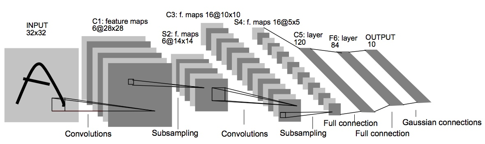

从CNN鼻祖LeNet5、再到掀起深度学习浪潮的AlexNet，CNN发展到今天，出现了众多网络结构，诸如VGG、GoogleNet、ResNet、DenseNet、ResNext。这些网络结构都是怎样的，他们之间有哪些联系与区别，本文将梳理CNN的发展脉络，解读其进化之路。

CNN的进化之路可以说是，不断更好地引入先验知识（Prior）的过程。理论上（universal approximation theorem）来说单隐藏层的普通全连接神经网络便能拟合任意函数，这种能力看起来很神奇，貌似有能力将任意输入映射到任意你想要的输出上去。比如，输入你自己的名字到网络中去，然后想让网络输出《清明上河图》，可以，把你名字倒过来输入到网络中，让图中茶馆某个喝茶的客人变成你，也可以，但仅仅是理论上的，实际上但受制于训练数据与不受控的拟合过程，对于一个单隐藏层经典全连接神经网络来说，几乎是不可行且不可能的。怎么才有可能？根据CNN的发展过程来看，就是去引入先验知识，去约束这种看起来十分神奇的任意拟合能力。事实上，CNN的卷积层在全连接基础引入局部连接与权值共享的约束，可以看做一种特殊的全连接层，这些约束包括Relu激活函数、池化层，都可以看做是引入的先验知识，将神经网络任意拟合能力约束到一个更窄的范围内，在这个更窄的能力范围内给我们想要的东西，事实上在有限的数据集下CNN对二维于图像数据、一维文本数据均有着不错的特征提取能力。那么怎么才能更好地引入先验知识来决定实际问题？不好意思，目前整体上深度学习领域的研究还处于trial and error的阶段，相关的指导理论并没有成熟，就像其他很多实验科学一样，在试验阶段不断总结经验教训，在经验基础上经过理想化形成指导理论，我们接下要看的这些在进化路上CNN架构就是升华经验、形成指导理论的基石。

应该指出，CNN作为一种较为通用的特征学习提取方法，在计算机视觉、自然语言处理、网络安全、医药基因领域都有着广泛的应用，但CNN的研究起源于计算机视觉领域，几次重大的突破也是在计算机视觉相关应用场景下取得的，所以本文是以计算机视觉领域应用为主线进行介绍。

## LeNet5
网络结构图：

LeNet5是目前公认的卷积神经网络鼻祖，由号称“深度学习三巨头”之一的Yann LeCun提出，经历前期的几次迭代，成型于90年代末，并成功应用在实际的商业产品上，用于识别支票。虽然有了成功的应用，但是卷积神经网络作为特征提取的一个方向在当时没有引起太多人关注，相关跟进研究工作也不多，基本上算是停滞了10多年的时间，在这一段时间里计算机视觉学术界与工业界关注的焦点，主要是诸如SIFT、HoG等手工特征提取方法，以及在这些手工特征基础的研究与应用，直到2012年AlexNet的提出，在ImageNet2012年的比赛上取得重大突破，才让卷积神经网络重回研究人员的视野，引发了深度学习技术革命浪潮。

论文原文：[LeCun et al. Gradient-Based Learning Applied to Document Recognition](http://10.3.200.202/cache/7/03/yann.lecun.com/b1a1c4acb57f1b447bfe36e103910875/lecun-01a.pdf)

## AlexNet
网络结构图：

论文原文：
[ImageNet Classification with Deep Convolutional Neural Networks](https://www.cs.toronto.edu/~fritz/absps/imagenet.pdf)
## VGG
网络结构图

VGG more popular than GoogelNet

论文原文：[Very Deep Convolutional Networks for Large-Scale Image Recognition](https://arxiv.org/pdf/1409.1556.pdf)
## GoogleNet
#### Inception v1
#### Inception v2
#### Inception v3
#### Inception v4
## ResNet
## DenseNet
## SENet
## FPN

## 参考文献：
1. [各个论文原文不再列举]()
2. [从LeNet-5到DenseNet](https://zhuanlan.zhihu.com/p/31006686)
3. [CNN浅析和历年ImageNet冠军模型解析](http://www.infoq.com/cn/articles/cnn-and-imagenet-champion-model-analysis)