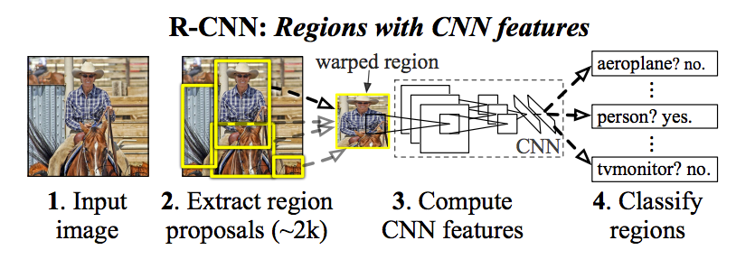

### （持续更新中）

从R-CNN、SPP-Net、Fast R-CNN、Fater R-CNN到Mask R-CNN，这一路算是在深度学习时代目标检测（object detection）的里程碑式的论文，是two-stage这个分支的代表作。R-CNN怎么就越来越faster了？Mask R-CNN添加一个分支就把目标检测与实例分割（instance segmentation）联系起来了？本文将梳理R-CNN这一支的发展历程，解读其魔改之路。

## R-CNN
R-CNN大概在2013年末提出来，距离引发这一波计算机视觉、人工智能革命浪潮重磅的AlexNet论文刚发表不久。当时研究者们还在讨论AlexNet的模型知识能不能迁移到目标检测的任务中来，目标检测领域在已经处于停滞状态，依靠各种魔改DPM（deformable part model）模型，加上各种集成（ensemble）方法的操作，在PASCAL VOC数据集每年带来可怜的几个百分点的提升。

Features matter! AlexNet之所以能在ImageNet的图像分类任务中取得大幅度提升，就是因为摆脱了表征能力弱的手工设计的特征，如SIFT、HOG等，采用了深度卷积神经网络的模型来学习得到的特征。R-CNN采用CNN网络提取的特征，也是其命名的由来，Regions with CNN features。

### 测试过程：
R-CNN测试过程的分为两个阶段：

第一阶段从原图上运行selective search 得到一些RoI（约2k个），然后把这些RoI resize到固定大小（227x227），依次送入CNN网络提取特征。第二阶段，把提取到的特征送入由1 vs all策略构成的SVM分类器，得到所属类别，同时进行bounding box regression对RoI的坐标进行修正。

### 训练过程：
分为3个步骤：

### 1. 微调（fine-tuning）
将ImageNet训练的CNN模型，在特定数据集上（如Paccal VOC）进行微调，相当于以小一个数量级的学习率（0.001）再做一遍分类任务的训练。注意有个采样比例：RoI与任意ground truth的IoU >0.5，就算作正样本，否则是负样本，按照正负样本1：3比例进行采样。

#### 2. 训练SVM分类器    
#### 3. 训练bbox回归器

### R-CNN的缺点：
#### 1. 训练流程复杂
首先需要对CNN模型进行fine tuning，然后训练SVM分类器，还要训练一个bounding box regressor，流程较多而且彼此独立。

#### 2. 训练过程时间、空间代价较高
由于需要单独训练SVM和bbox回归器，中间特征文件需要单独存储，在VOC2017只有5k的数据集上，硬盘空间需要几百个G，单GPU需要2、3天的时间。

#### 3. 检测速度慢
在R-CNN中，每个RoI都要单独运行一遍CNN提取特征的过程，每张图片都需要运行2000多次CNN模型，这无疑是比较缓慢的。使用VGG16作为CNN backbone 特征提取器，R-CNN在GPU上检测一张图片大约需要47s。

---

## SPP-Net
SPP-Net命名上好像与R-CNN没多少关系，名气也不如那几个，但正是SPP-Net的贡献才使得R-CNN越来越快，后续的Fast R-CNN也是整合了SPP-Net的关键方法。

### SPP-Net关键方法：
#### 1. 特征图计算共享
前面说到R-CNN对每张图片都需要运行2000次左右的CNN网络，这个特征提取的步骤是其计算瓶颈。

SPP-Net将整张图片送入CNN网络，得到整张图片的特征图，把selective search 得到的proposal，依次在映射到整张特征图上，直接从特征图上获得各自的特征图，这相当于共享了计算，一下就把速度提升了一到两个数量级。

#### 2. Spatial pyramid pooling layer
由于CNN网络结构的后面一般存在全连接网络，所以对输入图片的大小有所限制，R-CNN中就要对proposal resize 到固定大小（227x227）。SPP-Net提出了在全连接之前加入Spatial pyramid pooling 这个层，这个层把图片划分为一系列网格（1x1, 2x2, 6x6），每个网格内用maxpooling提取一个一个值，这样无论怎样大小的图片都可以提取到固定网格大小的特征。最后将这些固定网格大小的数据铺展成一维拼接在一起，形成这层的输出向量。

SPP-Net较好的减轻了R-CNN检测速度慢的问题，相对R-CNN提高了102倍。但是对于流程复杂、储存空间要求高的缺点没有解决，特征提取、SVM分类、bbox回归器依然需要单独训练，中间的特征文件还是得先存入硬盘中。

---

## Fast R-CNN
Fast R-CNN 整合了一些来自SPPNet的方法，比如特征图计算共享，还有RoIPooling layer，RoIPooling layer 就相当于Spatial pyramid pooling layer只用了一个网格大小。

## Faster R-CNN

## Mask R-CNN

## 其他变种
### Light-Head R-CNN

## 参考文献
1. [DPM模型原始论文-Object Detection with Discriminatively Trained
Part Based Models](http://cs.brown.edu/people/pfelzens/papers/lsvm-pami.pdf)
2. [Selective Search for Object Recognition](https://ivi.fnwi.uva.nl/isis/publications/2013/UijlingsIJCV2013/UijlingsIJCV2013.pdf)