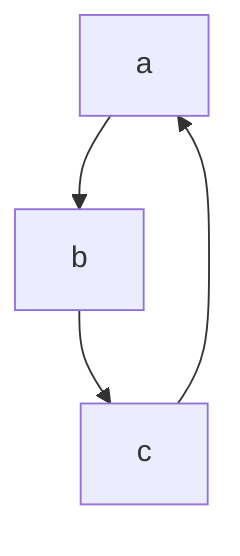

# Work Summary

## 工作流

1. 想法
   - 自己梳理构思
   - 错误分析
   - 看书、看论文
   - 与别人讨论交流
2. 编程
   - python scala
   - spark
3. 实验
   - 保证快速迭代：辅助实验工具
   - 保证规范性、可复现：线上工具
   - 设置两组实验并行跑：一组单变量实验，稳步推进；一组多变量实验，更激进地验证想法。
4. 日志
   - 保证启动的任务，日志可查。



设置目标 --> 评估当前状态与目标的差距，调整工作流 --> 完成目标
了解基本元素，了解基本机制，了解元素、机制组合方式
-->简化、抽象工作流 --> 复杂化、细节化工作流
实践：快速尝试和迭代实践 --> 理论：最佳实践、别人的经验、讨论交流

## 目标、分维、迭代

1. 设置总体目标
2. 拆分出三个或多个工作维度
3. 为每个工作维度设置渐进的迭代目标
4. 每次选取工作维度一部分，进行实现。
5. 评估当前状态和工作维度目标的差距，调整工作方式、总体目标、工作维度目标

## 提高工作效率

### 开发工具统一快捷键(shortcut)

- 统一高频使用的快捷键
  我常用编辑器是 VS Code，常用的 IDE 有 PyCharm 和 IntelliJ IDEA，还有一个快速开发环境是 Jupyter Notebook。它们的默认快捷键是不一致的，统一各种开发工具的快捷键有助于提高开发效率。

- 删除不需要的快捷键

1. reformat

   command + option + f

2. show function signature（IDEA: quick documentory）

   command + option + h

3. rename

   command + option + n

## 常用工具

### Git

1. 提交 Merge Request 前 Squash and rebase，领先 master 分支一个 commit.
2. Commit 后的代码莫名消失，git reflog，git reset --hard "正常 commit"
3. 提交 Merge Request 的 commit 以如下大写字母开头，ADD（增加新功能）、UPDATE（更新代码）、FIX（修复 BUG）、REMOVE（删除代码）；正在开发中的代码 commit 用 WIP（Working In Progress）开头。
4. 增删代码独立提交 commit，分别使用 ADD、REMOVE，这样 review 会更清晰，master 出问题时回滚 commit 更可控。

### Hive

1. 不小心删表 .Trash 中找回, 新建表，hadoop mv .Trash/表
2. MSCK repair partition

### Spark

1. 用 withColumn()减少 for 循环

### Docker

#### Custum command

1. delete all image except "9f38484d220f" and "2e24f20bf6af"

   ```bash
   # docker image rm --all-except "9f38484d220f" "2e24f20bf6af"
   docker image ls | grep -v "9f38484d220f \| 2e24f20bf6af" | tr -s " " | cut -d " " -f 3
   ```

   - grep -v：inverse select
   - tr -s " "：squeeze space
   - cut -d " " -f 3：在用空格隔开的一行中，用找出第三列。

#### Startup Image

### Jupyter Notebook

1. 更改快捷键绑定
   > It is possible to enable ctrl-s for saving by adding the following to .jupyter/custom/custom.js:
   >
   > ```js
   > require([
   >   "nbextensions/vim_binding/vim_binding",
   >   "base/js/namespace"
   > ], function(vim_binding, ns) {
   >   // Add post callback
   >   vim_binding.on_ready_callbacks.push(function() {
   >     var km = ns.keyboard_manager;
   >     // Indicate the key combination to run the commands
   >     km.edit_shortcuts.add_shortcut(
   >       "ctrl-s",
   >       "jupyter-notebook:save-notebook",
   >       true
   >     );
   >     // Update Help
   >     km.edit_shortcuts.events.trigger>("rebuild.QuickHelp");
   >   });
   > });
   > ```
   >

参考：
[always-squash-and-rebase-your-git-commits](https://blog.carbonfive.com/2017/08/28/always-squash-and-rebase-your-git-commits/)
